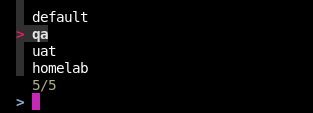

<a href="https://zerodha.tech"></a>

# nomctx

Faster way to switch between [Nomad](https://www.nomadproject.io/) clusters and namespaces. Inspired from [kubectx](https://github.com/ahmetb/kubectx/).


## Why was this created

If you're operating multiple Nomad clusters, switching between these clusters is a cumbersome task of exporting variables in shell. Ideally `nomad`, should use a file similar to `~/.kube/config` for authenticating against multiple clusters as described in this [issue](https://github.com/hashicorp/nomad/issues/11043). Since this feature isn't available as of yet, I've created `nomctx` which can emit the [environment-variables](https://www.nomadproject.io/docs/commands#environment-variables) required by `nomad` CLI for authentication.

## Installation

- Binaries: [Releases](https://github.com/mr-karan/nomctx/releases).
- Go: `go install github.com/mr-karan/nomctx@latest`

To run:

```bash
$ nomctx
```

By default `nomctx` searches for the file in `~/.nomctx/config.hcl` but you can override that with `--config=</path/to/config.hcl>` flag.


## Usage

```bash
NAME:
   nomctx - Faster way to switch across multiple Nomad clusters and namespaces

USAGE:
   nomctx [global options] command [command options] [arguments...]

VERSION:
   v0.1.1 (Commit: 2023-01-30 08:34:52 +0530 (844bef4), Build: 2023-05-25% 09:57:59 +0530)

COMMANDS:
   list-clusters     List all clusters
   list-namespaces   List all namespaces
   set-cluster       Set the current cluster context
   set-namespace     Set namespace
   switch-cluster    Switch cluster
   switch-namespace  Switch namespace
   current-context   Display the current context
   login             Login to a cluster
   help, h           Shows a list of commands or help for one command

GLOBAL OPTIONS:
   --config value  Path to a config file to load. (default: "/home/karan/.nomctx/config.hcl")
   --help, -h      show help
   --version, -v   print the version
```

### Interactive Mode

If you have [`fzf`](https://github.com/junegunn/fzf) installed, the tool will show an interactive prompt for switching `clusters` or `namespace`.





### Login with SSO

If you've configured authentication with SSO, you can use `login` command to login to a cluster. This will open a browser window where you can authenticate with your SSO provider.

By default, `nomctx` will login to the active cluster set in the config file. If you want to login to a specific cluster, use `--cluster=<cluster-name>` flag.

```bash
# Login to the active cluster
nomctx login
# or specify a cluster
nomctx login --cluster=dev

# Persist the session token to a file in `~/.nomctx/<cluster>.env`
nomctx login --cluster=dev --persist
```

See [Persist variables](#persist-variables) section for more details on how to persist the Nomad session tokens to a file.

### Non Interactive Mode

If you don't have `fzf`, you can use switch manually with `set-cluster=<>` and `set-namespace=<>` commands.

#### List all clusters

```bash
nomctx list-clusters
local
bangalore
tokyo
paris
singapore
```

#### List all namespaces

```bash
nomctx list-namespaces
homelab
uat
qa
default
```

#### Set a cluster

```bash
nomctx set-cluster=bangalore
export NOMAD_ADDR=http://10.0.0.1:4646
export NOMAD_TOKEN=f8cb5774-749a-4548-acc9-054df3b52e83
export NOMAD_HTTP_AUTH=user:pass
export NOMAD_NAMESPACE=pink
```

#### Set a namespace

```bash
nomctx set-namespace=uat    
export NOMAD_NAMESPACE=uat
```

#### View current context

```bash
$ nomctx current-context
Cluster: local
Namespace: default
```

### Persist variables

With `--persist` flag, you can persist the environment variables to a file. This is useful if you want to use the variables in a script.
The variables are written to `~/.nomctx/<cluster>.env` file.

```bash
nomctx set-cluster --persist dev

# You can see the env variables are written to the file.
cat ~/.nomctx/dev.env
NOMAD_ADDR=http://127.0.0.1:4646
NOMAD_NAMESPACE=default
```

### Set variables on shell

You can use `eval` to directly set the environment variables on shell. This works with both the interactive and non-interactive modes.

For eg, to switch a cluster in interactive mode **and** set the env vars on shell:

```bash
eval $(nomctx)

# You can see the env variables are automatically exported on shell.
env | grep NOMAD_
NOMAD_ADDR=http://10.0.0.1:4646
NOMAD_TOKEN=c0a7d714-46df-4c6e-954a-269578c3804d
NOMAD_NAMESPACE=pink
NOMAD_HTTP_AUTH=user:pass
NOMAD_REGION=paris
```

## Configuration

Here's a sample config file which shows 2 clusters: `dev` and `prod`:

```hcl
clusters "dev" {
  address   = "http://127.0.0.1:4646"
  namespace = "default"
}

cluster "uat" {
  address = "https://nomad.hashicorp.rocks"
  auth {
    method   = "gitlab"
    provider = "nomad"
  }
}

clusters "prod" {
  address   = "http://10.0.0.3:4646"
  namespace = "blue"
  region    = "blr"
  token     = "f8cb5774-749a-4548-acc9-054df3b52e83"
}
```

## LICENSE

See [LICENSE](./LICENSE)
